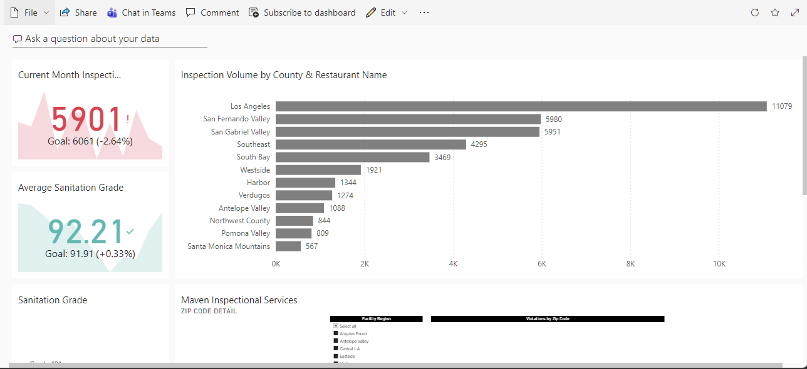
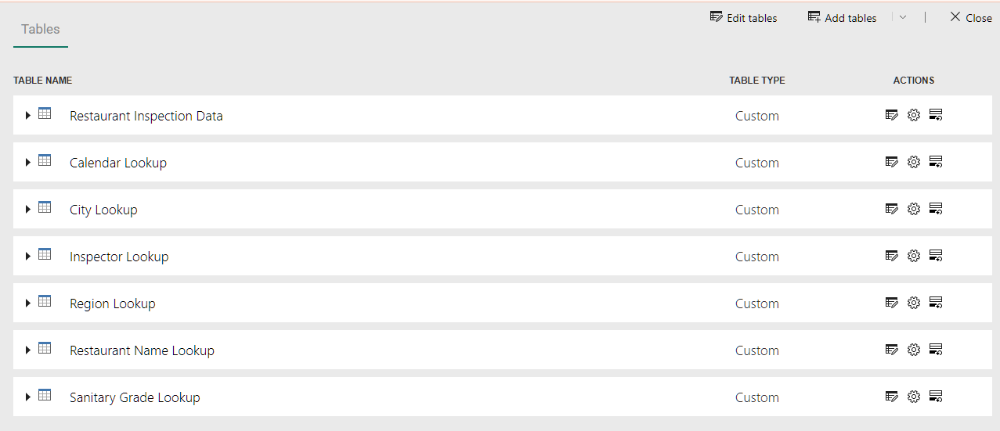
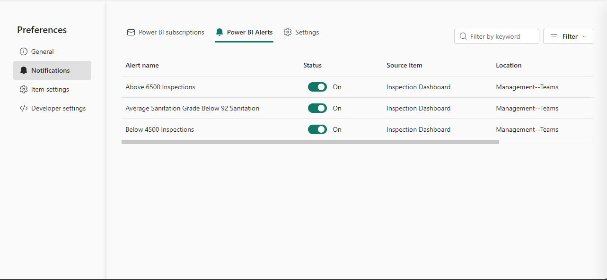
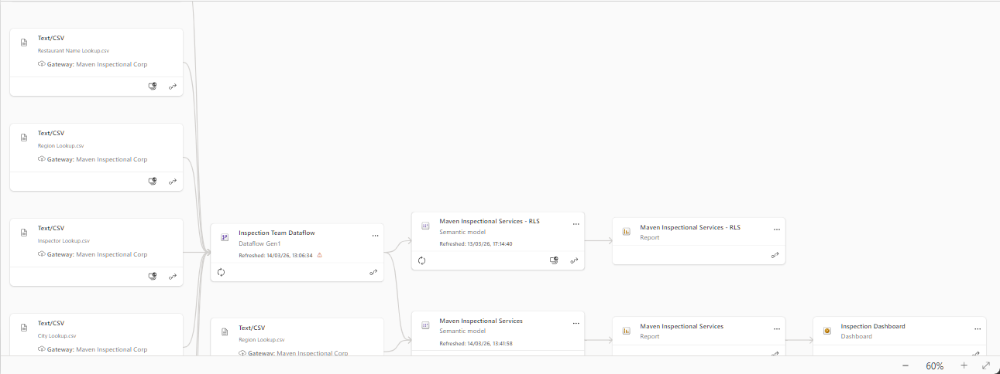
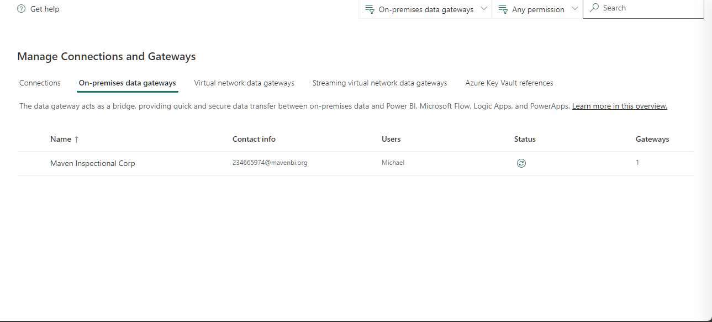
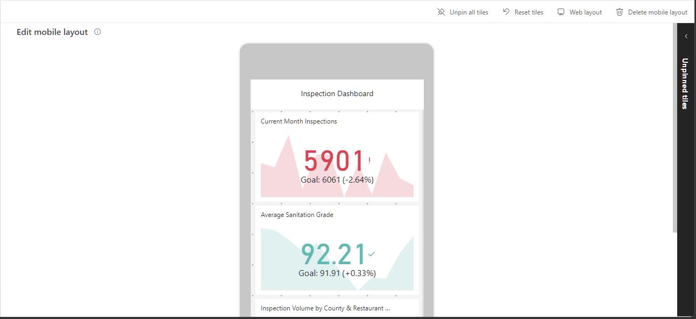
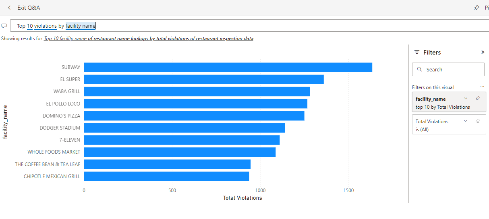
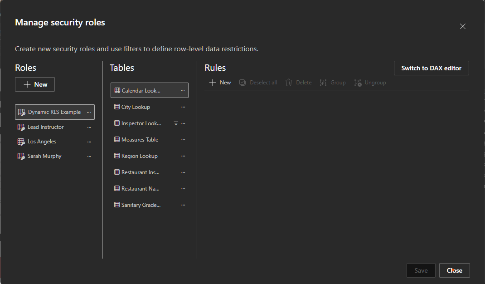
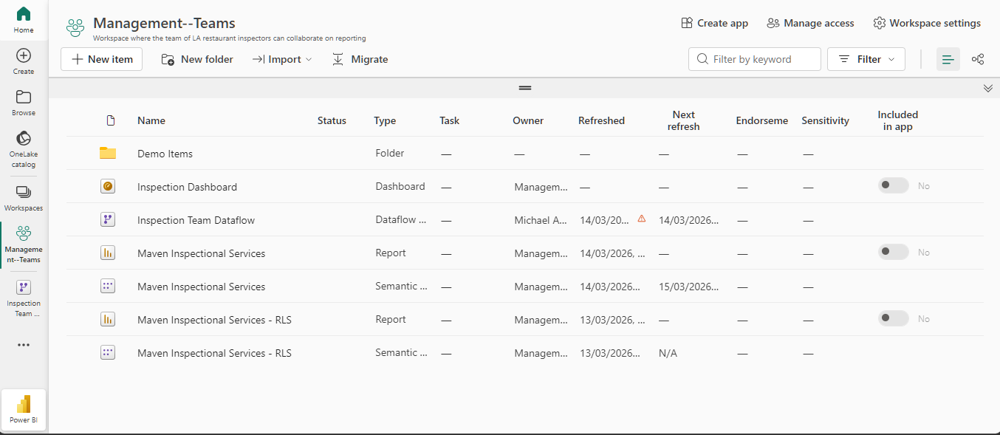

## Power-BI-Service-Reporting-Workspace-Management-Maven-Inspection-Services
## Download Report
Download the Power BI report file:
[MavenInspectionalServices.pbix](MavenInspectionalServices.pbix)

# Business Scenario
In this project, I assumed the role of a Business Intelligence Analyst at Maven Inspectional Services, a restaurant health inspection agency based in Los Angeles, California.
The organization needed a scalable reporting solution to analyze restaurant inspection data and share insights across teams. The dataset consisted of multiple CSV files containing information about restaurants, inspections, inspectors, and violation records.
The objective was to use Power BI Desktop and Power BI Service to build and deploy a collaborative analytics environment for monitoring inspection performance and operational trends.

## Tools & Technologies
-	Power BI Service
-	Power BI Desktop
-	Microsoft Fabric
-	Power BI Dataflows
-	On-Premises Data Gateway
-	Semantic Models
-	Row-Level Security (RLS)
-	CSV Data Sources

## Key Tasks Performed
Power BI Environment Setup
-	Explored the Power BI ecosystem and Microsoft Fabric platform
-	Configured Power BI account and workspace environment
-	Created and organized workspaces and workspace folders

## Data Integration
-	Loaded multiple CSV datasets into Power BI Service
-	Configured an On-Premises Data Gateway for local data access
-	Built Power BI Dataflows for centralized data transformation
-	Compared Dataflow Gen1 vs Gen2 architecture
-	Configured scheduled refresh for automated data updates

## Data Modeling
-	Created and managed semantic models
-	Monitored dataset relationships using data lineage view
-	Connected reports to centralized data models

## Report Development
-	Built reports in Power BI Desktop
-	Published reports to Power BI Service
-	Used interactive visualizations and filters for analysis

## Dashboard Development
-	Pinned report visuals to Power BI dashboards
-	Pinned entire reports as dashboard tiles
-	Assembled an executive-level inspection monitoring dashboard

## Advanced Power BI Features
-	Implemented Natural Language Q&A
-	Created data-driven alerts
-	Added personal bookmarks
-	Designed mobile-optimized reports
-	Configured static and dynamic Row-Level Security (RLS)

## Dataset
The dataset consists of multiple CSV files containing:
- Calendar lookup
- City lookup
- Inspector lookup
- Region lookup
- Restaurant Inspection data
- Restaurant Name lookup
- Sanitary Grade lookup## Key Features

## Key Features
- Created Power BI workspace for collaborative reporting
- Built dataflows for centralized data transformation
- Configured on-premises data gateway
- Enabled scheduled dataset refresh
- Implemented dashboards and report pinning
- Used Q&A natural language query
- Created data-driven alerts
- Implemented Row-Level Security (RLS)
- Designed mobile-optimized dashboards
- Used data lineage to track dataset relationships

## Dashboard

## Dataflow

## Data Driven Alert

## Data Lineage

## Gateway Setup

## Mobile Layout

## Q&A

## RLS Setup

## Workspace

## Outcome
The project demonstrates how Power BI Service can be used to deploy, manage, and share enterprise BI solutions. By combining dataflows, semantic models, and interactive dashboards, the platform enables collaborative data analysis and automated reporting across the organization.
